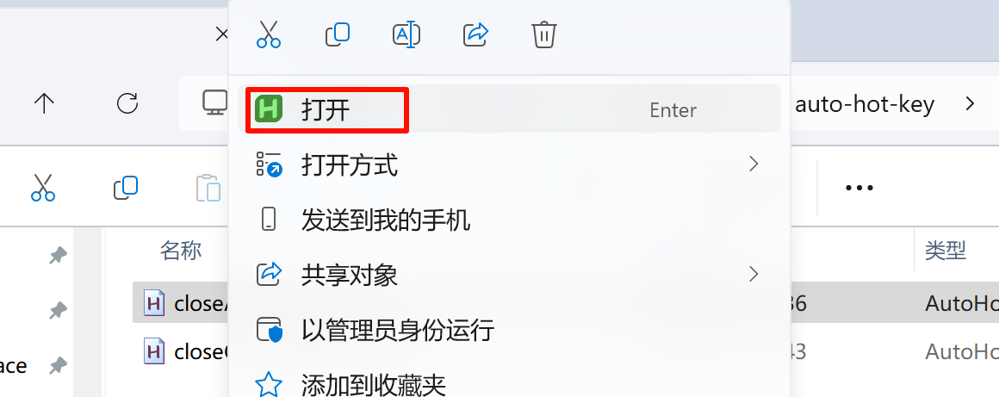
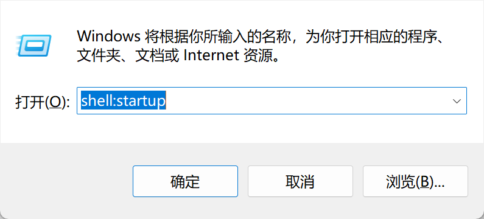
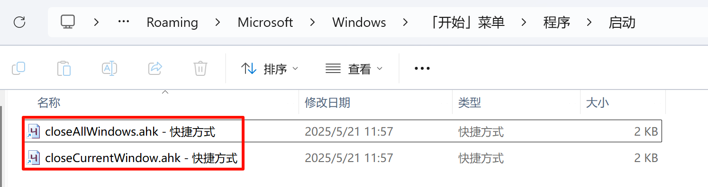

# auto-hot-key
编写的一些 AutoHotKey 的脚本，目前脚本都是基于 AutoHotKey 2.0 的。

目前有两个实用性脚本

- 外接多个显示器时，一键最小化当前显示器的所有窗口。
- 一键最小化当前窗口。

未来可能根据需要添加其他脚本，具体请查看`/script`目录下的脚本文件，脚本的具体用途和热键设置（可按需自行替换）都在脚本文件的注释中有说明。

# 使用方式

## 安装本体

从 [AutoHotkey](https://www.autohotkey.com/) 下载和安装程序本体，当前最新版本为 2.0。

> 最好安装在默认的`C:\\programes`目录下，不要安装到其他位置，因为该程序需要操作程序目录下的文件的权限。

## 运行脚本

从[auto-hot-key/script](https://github.com/icexmoon/auto-hot-key/tree/main/script)下载脚本文件，右键打开：



如果能正常运行，任务栏托盘就会出现脚本标识：


> 右键可以操作脚本，比如暂停脚本或退出。

## 开机自启

`win+R`打开运行窗口，输入`shell:startup`：



打开的文件目录为 Windows 当前用户登录后会自动执行的程序目录，为需要开机自启动的脚本创建快捷方式，并复制粘贴到这里：



# 开发&&调试

编写 ahk 脚本建议使用 VSCode。

插件可以使用这个：


可以对代码格式化以及高亮显示。

还有这个：


可以调用 AHK 的主程序进行 debug，方式与一般的软件开发一样，先配置一个 debug 配置。即在工程目录下添加`.vscode/launch.json`：

```json
{
    // 使用 IntelliSense 了解相关属性。 
    // 悬停以查看现有属性的描述。
    // 欲了解更多信息，请访问: https://go.microsoft.com/fwlink/?linkid=830387
    "version": "0.2.0",
    "configurations": [
        {
            "type": "ahkdbg",
            "request": "launch",
            "name": "A new configuration for 'debugging' AutoHotKey.",
            "program": "",
            "stopOnEntry": true,
            "captureStreams": true,
            "runtime": "C:\\Program Files\\AutoHotkey\\v2\\AutoHotkey.exe",
            "port": 9005
        },
        {
            "type": "ahkdbg",
            "request": "launch",
            "name": "AHKDebug",
            "program": "${file}",
            "stopOnEntry": false,
            "captureStreams": true,
            "runtime": "C:\\Program Files\\AutoHotkey\\v2\\AutoHotkey.exe",
            "port": 9005
        }
    ]
}
```

如果是通过插件自动生成，这里的`runtime`需要手动调整下，默认生成的配置使用的主程序位置缺少`v2`目录。

# 其它建议

如果我这里的脚本不符合你的需要，你可以自行修改/编写 AutoHotKey 脚本（ahk 文件）。AutoHotKey 官网有详细的语法说明和示例。

如果你想速成（tou lan），可以借助 AI 编写脚本。实际上我第一次编写的这两个脚本的大部分工作都是 AI 完成的，我只负责提出需求、 DEBUG 和添加注释。

我这里使用的是腾讯元宝，相比 DeepSeek 原版，最大的优势是响应速度快（腾讯更有钱）。但要特别注意的是，最好**使用 DeepSeek模型（默认不是）以及开启深度思考和联网搜索**，否则你可能遇到和我一样的坑爹问题（各种语法错误，不懂装懂以及车轱辘话来回说）。

